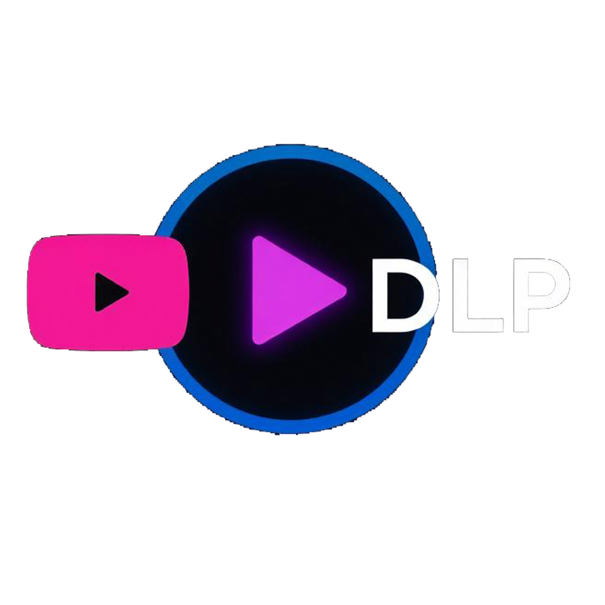
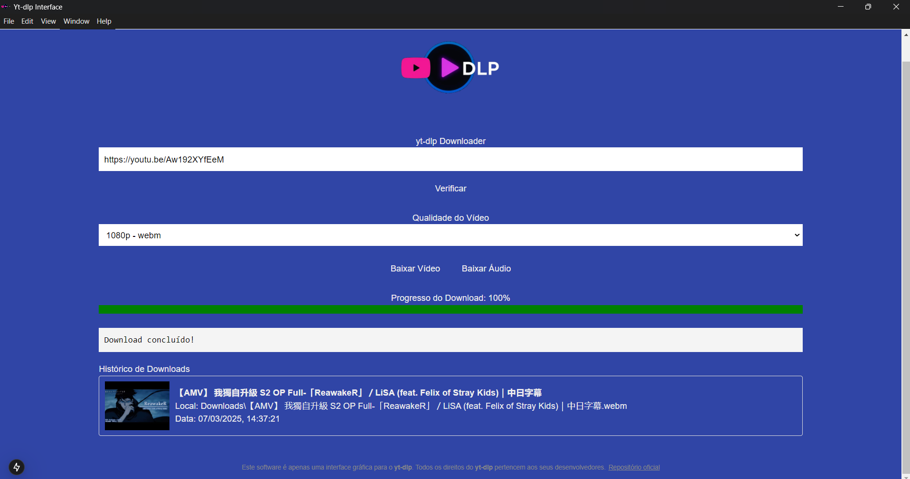

<p align="center">
  
</p>
<h3 align = "center" fontSize="60px">
  Interface para o Yt-dlp
</h3>

<p align="center">
  <h3 align = "center" fontSize="60px">
    Yt-dlp Interface
  </h3>
  
  
</p>

# yt-dlp Interface com Next.js e Electron

Este projeto é uma interface gráfica para o [yt-dlp](https://github.com/yt-dlp/yt-dlp), um fork do popular programa de linha de comando `youtube-dl`, que permite baixar vídeos e áudios de plataformas de streaming.
A interface é construída usando [Next.js](https://nextjs.org/) para a parte frontend e [Electron](https://www.electronjs.org/) para empacotar a aplicação como um aplicativo de desktop.

## Funcionalidades

- **Busca de informações do vídeo**: Insira uma URL de vídeo e veja as opções de formatos de vídeo, áudio e legendas disponíveis.
- **Download de Vídeos e Áudios**: Selecione o formato desejado e faça o download diretamente para seu computador.
- **Suporte para Legendas**: Baixe as legendas disponíveis junto ao vídeo.

## 📌 Tecnologias Utilizadas

- 
  Framework React para a criação de interfaces de usuário dinâmicas e de fácil SEO.
- 
  Biblioteca JavaScript para construção de interfaces de usuário.

- 
  Framework para criar aplicativos desktop com tecnologias web como HTML, CSS e JavaScript.

- 
  Ferramenta de download de vídeos, que oferece suporte a diversos sites de streaming.

- 
  Superset do JavaScript que adiciona tipagem estática.

## 🚀 Como Rodar o Projeto Localmente

### Pré-requisitos

Antes de rodar o projeto, você precisa ter o seguinte instalado:

- **Node.js** (versão 16 ou superior) - [Instale o Node.js](https://nodejs.org/)
- **Yt-dlp** - [Instale o yt-dlp](https://github.com/yt-dlp/yt-dlp#installation)

### Passo a Passo

### 1️⃣ Clonar o repositório

```bash
git clone https://github.com/Sub-Dev/yt-dlp-interface-electron
cd yt-dlp-interface-electron
```

### 2️⃣ Instalar dependências

```bash
npm install

```

### 3️⃣ Baixe o yt-dlp.exe para a pasta bin:

- Baixe a versão do yt-dlp para o seu sistema operacional a partir de aqui.
- Coloque o arquivo yt-dlp.exe dentro da pasta bin na raiz do projeto.

Crie um arquivo `.env` na raiz do projeto e configure:

### 4️⃣ Execute o projeto:

Para rodar a aplicação em modo de desenvolvimento (Next.js + Electron):

```bash
npm run dev

```

O Next.js irá rodar na porta 3000, e o Electron abrirá a interface como um aplicativo de desktop.

## 👥 Autor

<table>
 <tr>
 <td alinhar="centro">
 <a href="https://github.com/Sub-Dev" target="_blank">
 
 </a>
 </td>
 <td>
 <strong>Anthony Marin</strong> (Sub-Dev) - <a href="https://github.com/Sub-Dev">Perfil no GitHub</a>
 </td>
 </tr>
</table>

## Licença

Este projeto está licenciado sob a Licença MIT.
